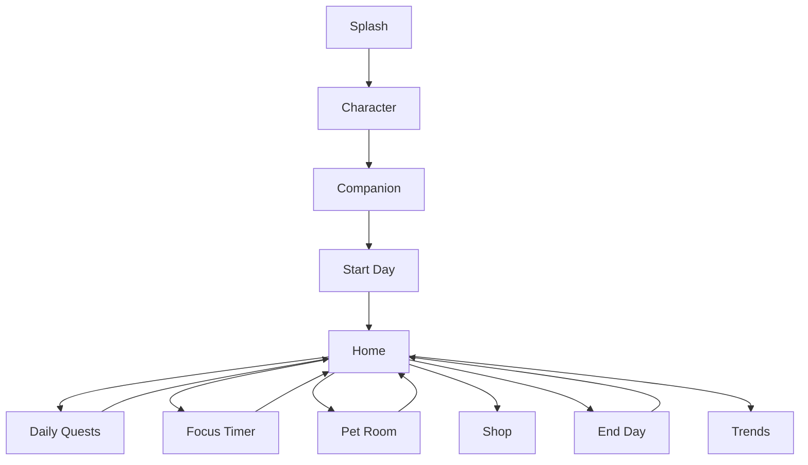

# Wireflow

```mermaid
flowchart TD
  A[Splash] --> B[Character]
  B --> C[Companion]
  C --> D[Start Day]
  D --> E[Home]
  E --> F[Daily Quests]
  E --> G[Focus Timer]
  E --> H[Pet Room]
  E --> I[Shop]
  F --> E
  G --> E
  H --> E
  E --> J[End Day]
  J --> E
  E --> K[Trends]
```
